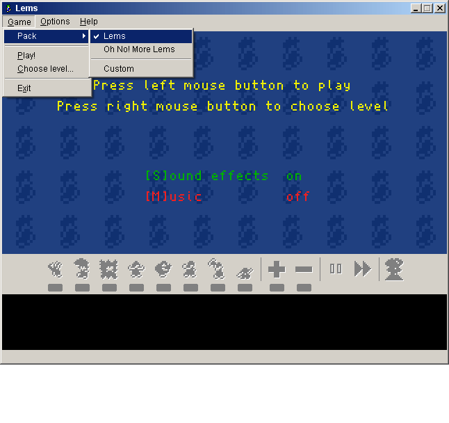



## A classic one \(and sequel\)

### Description

Remake of the well-known classic DOS game "Lemmings" and its sequel "Oh No! More Lemmings". Includes editor for designing your own levels. Have fun!  First release: 7/8/2005. Last update: 12/05/2011 (1.5.13) - Mainly full screen support, some aesthetical changes, and lots of "behaviour" improvements for our little friends (See History.txt for full list of changes). 
 
### More Info
 

             |
---                |---
**Submitted On**   |2011-11-25 15:00:54
**By**             |[Carles P\.V\.](https://github.com/Planet-Source-Code/PSCIndex/blob/master/ByAuthor/carles-p-v.md)
**Level**          |Intermediate
**User Rating**    |5.0 (800 globes from 160 users)
**Compatibility**  |VB 6\.0
**Category**       |[Games](https://github.com/Planet-Source-Code/PSCIndex/blob/master/ByCategory/games__1-38.md)
**World**          |[Visual Basic](https://github.com/Planet-Source-Code/PSCIndex/blob/master/ByWorld/visual-basic.md)
**Archive File**   |[A\_classic\_2216051252011\.zip](https://github.com/Planet-Source-Code/carles-p-v-a-classic-one-and-sequel__1-61601/archive/master.zip)

